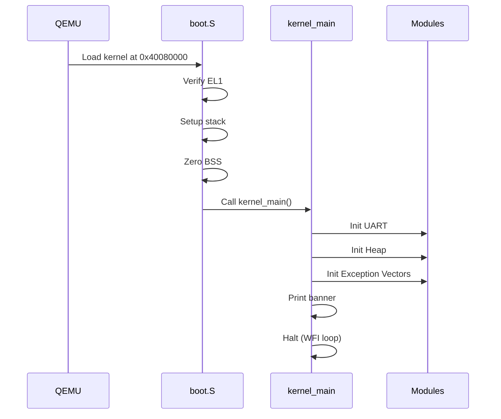

# System Architecture

This document describes the architecture of PantherOS, a minimal security-focused ARM64 kernel.

## Overview

PantherOS is a paravirtualized kernel designed to run on QEMU's `virt` machine. It leverages the hypervisor for hardware abstraction while focusing on secure kernel design patterns.

```
┌─────────────────────────────────────────────────────────────┐
│                     User Applications                        │
│                         (EL0)                                │
└─────────────────────────────────────────────────────────────┘
                            │ SVC
                            ▼
┌─────────────────────────────────────────────────────────────┐
│                      PantherOS Kernel                        │
│                         (EL1)                                │
├─────────────┬─────────────┬─────────────┬───────────────────┤
│  Syscall    │  Exception  │   Memory    │     Device        │
│  Handler    │  Handling   │  Manager    │    Drivers        │
└─────────────┴─────────────┴─────────────┴───────────────────┘
                            │
                            ▼
┌─────────────────────────────────────────────────────────────┐
│                    QEMU Hypervisor                           │
│                         (EL2)                                │
└─────────────────────────────────────────────────────────────┘
```

## Memory Map

```
0x40000000 ┌─────────────────────┐
           │   User Space        │  Available for user processes
           │   (512 KB)          │  
0x40080000 ├─────────────────────┤ ← Kernel Load Address
           │   .text (code)      │  Kernel executable code
           ├─────────────────────┤
           │   .rodata           │  Read-only data
           ├─────────────────────┤
           │   .data             │  Initialized data
           ├─────────────────────┤
           │   .bss              │  Zero-initialized data
           ├─────────────────────┤
           │   Stack (16 KB)     │  Kernel stack
           ├─────────────────────┤
           │   Heap (64 KB)      │  Dynamic allocations
           ├─────────────────────┤
           │   Free Memory       │  Available for expansion
0x48000000 └─────────────────────┘
```

## Boot Sequence



## Component Details

### Boot Layer (`boot.S`)

The assembly boot code handles:
1. **EL1 Verification** - Ensures we're at the correct exception level
2. **Stack Setup** - Points SP to linker-provided stack top
3. **BSS Zeroing** - Clears uninitialized data section
4. **Exception Vectors** - Provides the 2KB-aligned vector table

### Console Driver (`drivers/uart.rs`)

PL011 UART driver for QEMU virt machine:
- **Base Address**: 0x09000000 (QEMU virt UART0)
- **Features**: Blocking transmit, spinlock protection
- **Macros**: `kprint!` and `kprintln!` for kernel output

### Memory Manager (`mm/`)

Current implementation:
- **Static Heap**: 64 KiB linked-list allocator
- **Global Allocator**: Implements `#[global_allocator]`

Future plans:
- Physical page allocator (bitmap-based)
- Virtual memory management
- Per-process address spaces

### Exception Handling (`exception.rs`)

ARM64 exception handling:
- **Vector Table**: 16 entries (4 types × 4 sources)
- **Context Save**: Full register save/restore
- **Handlers**: Sync (syscalls), IRQ, FIQ, SError

### System Calls (`syscall/`)

Minimal syscall interface:

| Component     | Purpose                          |
|---------------|----------------------------------|
| `mod.rs`      | Module organization              |
| `handler.rs`  | Dispatch table and implementations |
| `validate.rs` | Input validation utilities       |

## Design Decisions

### Why Rust?

1. **Memory Safety** - Prevents entire classes of vulnerabilities
2. **Zero-Cost Abstractions** - No runtime overhead
3. **No Runtime** - Works in `no_std` environment
4. **Modern Tooling** - Cargo, Clippy, MIRI

### Why Paravirtualization?

1. **Simpler Drivers** - Virtio instead of hardware-specific
2. **Faster Development** - Skip complex hardware init
3. **Better Testing** - QEMU provides consistent environment
4. **Focus on Security** - Not hardware compatibility

### Why Whitelist Syscalls?

1. **Minimal Attack Surface** - Only implement what's needed
2. **Easier Audit** - Fewer paths to verify
3. **Fail Secure** - Unknown = denied

## Future Architecture

### Phase 2: Process Management

```
┌─────────────────────────────────────────────────────────────┐
│                     Process Table                            │
├──────────┬──────────┬──────────┬───────────────────────────┤
│  PID 1   │  PID 2   │  PID 3   │          ...              │
│  (init)  │  (user)  │  (user)  │                           │
└──────────┴──────────┴──────────┴───────────────────────────┘
```

### Phase 3: Virtual Memory

```
           Virtual Address Space (per process)
           
0x00000000 ┌─────────────────────┐
           │   NULL Guard        │  Catches null derefs
0x00001000 ├─────────────────────┤
           │   User Code         │  .text, .rodata
           ├─────────────────────┤
           │   User Data         │  .data, .bss
           ├─────────────────────┤
           │   User Heap         │  brk/mmap
           │        ↓            │
           │        ↑            │
           │   User Stack        │  Grows down
0x40000000 ├─────────────────────┤
           │   Kernel (mapped)   │  Same in all processes
           └─────────────────────┘
```

## References

- [ARM Architecture Reference Manual ARMv8](https://developer.arm.com/documentation/ddi0487/latest)
- [QEMU Virt Machine](https://www.qemu.org/docs/master/system/arm/virt.html)
- [Writing an OS in Rust](https://os.phil-opp.com/)
